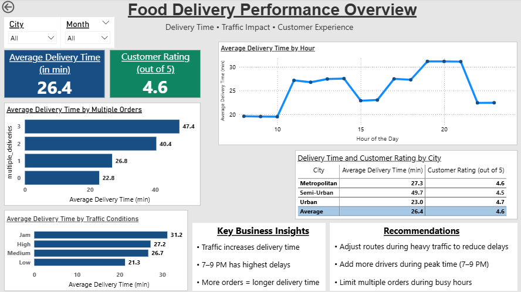

# Food Delivery Performance Analysis

## Project Overview

This project analyzes food delivery performance to understand how factors like traffic, time of day, and multiple orders impact delivery time and customer ratings.

The goal is to identify patterns and provide simple, practical insights to improve delivery efficiency and customer experience.

---

## Dashboard Preview

---

## Key Objectives

* Analyze delivery time trends throughout the day
* Understand the impact of traffic conditions
* Evaluate how multiple orders affect delivery time
* Explore the relationship between delivery time and customer ratings

---

## Tools Used

* Python (Pandas) – Data cleaning and preparation
* Power BI – Data visualization and dashboard

---

## Project Files

* `raw_data.csv` → Original dataset
* `cleaned_data.csv` → Processed dataset
* `data_cleaning.py` → Data cleaning and feature creation
* `dashboard.png` → Dashboard preview

---

## Data Preparation

* Removed duplicate records
* Handled missing values
* Standardized categorical data
* Converted time and date columns
* Created new columns:

  * Order Hour
  * Day of Week
  * Weekend Indicator
* Removed extreme delivery time values

---

## Key Insights

* Delivery time increases during heavy traffic
* Peak delays occur between 7–9 PM
* Multiple orders lead to longer delivery times
* Customer ratings slightly decrease as delivery time increases

---

## Recommendations

* Strengthen delivery operations during peak hours (7–9 PM)
* Add more drivers during high-demand periods
* Limit multiple orders during busy hours

---

## Conclusion

This analysis highlights how operational factors affect delivery performance. By focusing on peak hours, traffic conditions, and order management, delivery efficiency can be improved.

---

## Note

Missing city values were labeled as "Not Available" during data cleaning and excluded in dashboard-level analysis for consistency.
